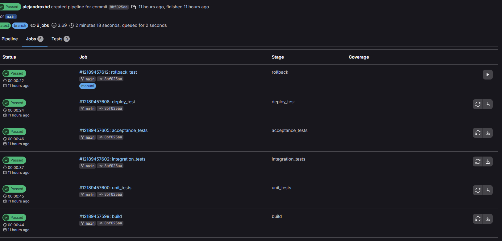

# Documento convertido desde Word

Actividad 1 

Creamos un proyecto Maven para realizar lo requerido, en este caso una calculadora de multiplicación.

También creamos el test correspondiente:

Archivo Pom.xml

Subimos la documentación a Github

Realizamos los test:

Actividad Dos.

Subiremos nuestro proyecto a Gitlab donde crearemos el archivo .gitlab-ci.yml

Al subir el proyecto se ejecutará automáticamente el pipeline. Podemos ver que las pruebas unitarias y de integración fueron correctas.

Actividad tres.

Para esta actividad editamos el archivo .gitlab-ci-yml

Tambien creamos la clase de pruebas de aceptación

Luego realizamos el commit a gitlab y ejecutamos las pruebas donde podemos ver que son existosas

## Imágenes

